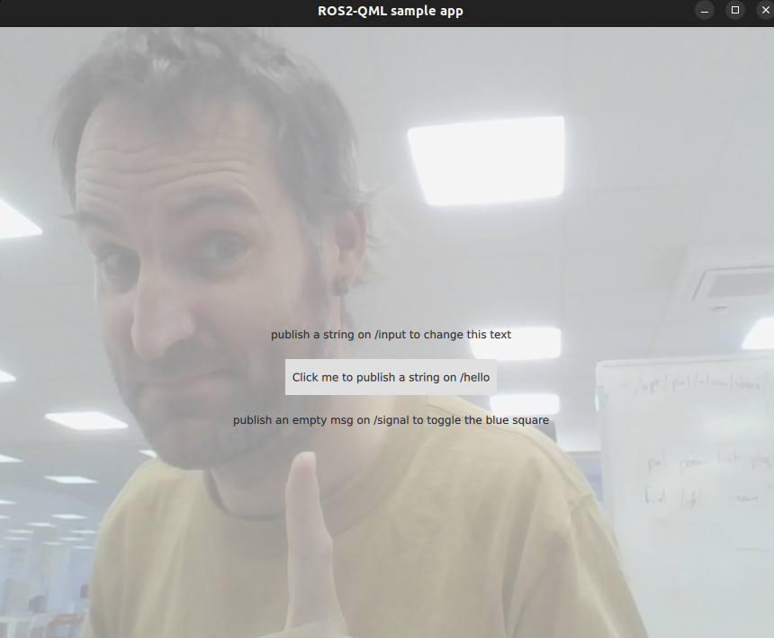

ROS 2 QML plugin
================



Requirements
------------

- `qt5`. On Debian/Ubuntu: `apt install qmake qt5-default qtdeclarative5-dev`
- ROS (tested with ROS humble. Check the `master` branch for kinectic and noetic support).

*Note that this has only been tested on Linux, and would likely require
significant work to get it to work on a different operating system.*

Installation
------------

You can install the plugin as any ROS 2 package, using `colcon`.
If you then source your ROS 2 environment, any qml application will be able to
use the plugin.

To compile:

```bash
> rosdep install --from-paths src --ignore-src -y # install dependencies
> colcon build --packages-select ros_qml_plugin
```

General Usage
-------------

**Important: always launch QtCreator from the command-line! otherwise, your ROS
configuration will not be set up, and QtCreator won't find the ROS libraries.**

In your QML files, import `Ros 2.0`:

```qml

import Ros 2.0
```

By default, the plugin creates a ROS node with the name `qml_ros2_node`. You can
change this by setting the `ROSNodeName` property in the QML context:

```cpp
QQmlApplicationEngine engine;

QString rosNodeName = "robot_head_display";
engine.rootContext()->setContextProperty("ROSNodeName", rosNodeName);
```

### Working 'Hello World' example

This example creates a blank window. If you click anywhere onto the window, the
string `Hello world` is published on the topic `/hello`:

```qml
import QtQuick 2.12
import QtQuick.Window 2.12

import Ros 2.0

Window {
    visible: true
    width: 640
    height: 480
    title: qsTr("Hello World")

    StringTopic{
        id: hello_publisher
        topic: "hello"

    }

    MouseArea {
        anchors.fill: parent
        onClicked: {
            hello_publisher.value = "Hello world"
        }

    }

}
```

Supported ROS features
----------------------

Check [sample.qml](examples/sample.qml) for a complete example.
You can actually test it by running `qmlscene examples/sample.qml` (cf
screenshot above).

Supports:

- [displaying a ROS image topic](#displaying-ros-image-topics)
- setting/reading ROS 2 parameters (`RosParam`) of basic type (string, int,
  float, bool). You must set the property `name` to the parameter name. If you
  also set the `node` property, the parameter will be set on that node,
  otherwise it will be set on the QML node itself.
- bi-directional event signaling (``RosSignal``) by sending an `Empty` message
  on a specfic topic
- publish and subscribe to string, int16, int32, float32 and bool topics
  (`StringTopic`, `IntTopic`, `Int32Topic`, `FloatTopic`, `BoolTopic`).
  To publish, set the `value` property. To subscribe, use the `onMessageReceived` signal.
- Create a `SetBool` service (`SetBoolService`)

#### Forcing a topic direction

By default, ROS topic are created as bidirectional. You can force a topic to be
either a publisher or a subscriber by setting the `isPublisher` and
`isSubscriber` boolean properties (both are `true` by default).

For instance, the value of `hello_publisher` will be published on the topic
`/hello`, but will never be overwritten by a message received on the same topic:

```qml
StringTopic{
    id: hello_publisher
    topic: "/hello"
    value: "Hello world"
    isSubscriber: false
}
```

### Skills

Supported skills:

- `SaySkill`: a skill that can be used to make the robot say something.
  
  Example:
  ```qml
  SaySkill {
      id: skill
  }
  skill.say("Hello world")
  ```
- `ChatSkill`: a skill that can be used to initiate a chat with a user.
  
  Example:
  ```qml
  SaySkill {
      id: skill
  }
  skill.start("You are an helpful robot assistant", "Hello! How can I help?") // first the chatbot prompt, then the initial speech. Both can be omitted
  skill.stop() // to end the dialogue
  ```
- `SetExpression`: a skill that can be used to set an expression on the robot.
  
  Example:
  ```qml
  SetExpression {
      id: skill
  }
  skill.set_expression("happy")
  skill.set_expression(0.7, -0.4) // using valence and arousal values
  ```
- `LookAtSkill`: a skill that can be used to make the robot look at a specific point in space.
  
  Example:
  ```qml
  LookAtSkill {
      id: skill
  }
  skill.look_at(Ros.point("base_link", 1.0, 0.0, 0.0))
  skill.look_at_faces()
  skill.look_around_randomly()
  skill.glance(Ros.point("base_link", 1.0, 0.0, 0.0), 1000) // glance at a point for 2 second
  skill.reset() // look straight ahead
  ```

- `NavigateToPoseSkill`: a skill that makes mobile platform to move to a specific
  pose in the world.
  
  Example:
  ```qml
  NavigateToPoseSkill {
      id: skill
  }
  skill.navigate_to_pose(Ros.pose("map", 1.0, 0.0, 0.0, 0.0, 0.0, 0.71, 0.71)) // x,y,z, qx, qy, qz, qw -> here a 90deg rotation around Z
  skill.navigate_to_pose(Ros.pose("map", 1.0, 0.0, 0.0)) // using only the position
  ```

### Live speech

The `LiveSpeechTopic` QML object can be used to either listen to incoming ASR results, or fake
speech recognition by publishing a `value`. The API is compatible with the ROS4HRI standard.

```qml
import Ros 2.0
LiveSpeechTopic {
    id: live_speech
    speaker_name: "joe" // by default, 'anonymous_speaker'
    onMessageReceived: {
        console.log("ASR result: " + message)
    }
}
MouseArea {
    anchors.fill: parent
    onClicked: {
        live_speech.value = "Hello world"
    }
}
```

### Displaying ROS image topics

This uses a special QML ``ImageProvider`` to read images from a ROS topic. Specify the topic using: `img.source = "image://rosimage/<your topic>"`.

Typical usage, that refreshes the image at 20Hz:

```qml
import Ros 2.0

Image {
	id: img
	cache: false

    property int counter: 0
	anchors.fill: parent
	source: "image://rosimage/v4l/camera/image_raw?" + counter.toString()

	Timer {
		interval: 50
		repeat: true
		running: parent.visible
		onTriggered: parent.counter += 1
	}
}
```

note that only a limited set of image formats are supported (`rgb888`, `bgr888`, `rgba8888`, `mono8`, `mono16`).


Similar projects
----------------

- https://github.com/StefanFabian/qml_ros2_plugin: similar project, with a focus
  on lower-level access to ROS 2 topics, actions, services. More generic, but
  slightly more complex to use.

